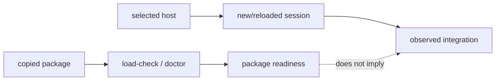

# Package delivery

This page explains the deployment boundary in code terms. A plugin package contains files a host may load; it does not contain the host's marketplace database, session state, or connector process table.

## Local-first onboarding

Keep the pinned `v1.0.2` release in a permanent folder, open or link it in the
selected host, give the agent
`https://github.com/elvinzhao10/LazyBuddy`, and type `onboard`. The agent asks
which host is in use, runs safe package checks, and reports package readiness
separately from host readiness. Before a host-managed marketplace, plugin,
Skills, or connector change it asks for approval, then gives one exact action
and waits. After the response it inspects the host with Computer Use; any
reload/new-session step is separate. WorkBuddy's supported fallback is Skills
import plus six individual manual local MCP connectors. Files or load-check
output never imply WorkBuddy commands, agents, hooks, or MCP loaded without a
real full-plugin session. Host proof must show one real Skill/command and every
expected MCP connection. If Computer Use is unavailable, a user-pasted verbatim
status or screenshot is observed evidence; otherwise **HOST READINESS:
PENDING**.

Route status is explicit: the local marketplace is the **documented CodeBuddy
CLI route**. CodeBuddy IDE plugin loading and WorkBuddy full-plugin loading are
**observed-build routes** only. The `manual-skills-mcp-fallback` is the
supported local fallback. Package checks never upgrade any route to host proof.

## Copyable versus observed state

`lazybuddy-plugin/` can be copied and checked in isolation. `scripts/lazybuddy-load-check.sh` inspects the selected package root, manifests, inventories, declarations, executable scripts, and tooling contract. `lazybuddy-plugin-doctor.sh` adds health diagnostics. Neither script asks a host to install a plugin or open an MCP connection.

The host is a second runtime. CodeBuddy and WorkBuddy choose how plugins are discovered, when hooks receive events, and when MCP launchers are spawned. The package models that with declarations and tests; it deliberately does not scan or mutate host-owned paths to infer success.

## Two evidence channels

The first channel supports claims about package contents. The second supports claims about host loading. Keeping the channels separate is what lets uninstall be safe: package removal cannot guess where a host stored marketplace or connector data.

## Delivery surfaces

CodeBuddy CLI uses the documented release-root marketplace commands
`/plugin marketplace add <absolute-local-LazyBuddy-path>` and, as a later
action, `/plugin install lazybuddy@lazybuddy`. CodeBuddy IDE's public fallback
is Skills import plus MCP JSON; plugin loading is build-specific. WorkBuddy's
supplied prerelease build exposed a full plugin route, but the supported local
fallback remains Skills-only import plus six manual connectors. The fallback
excludes commands, agents, and hooks. Full plugin/manual coexistence is
unsupported: stop the session, remove only old LazyBuddy entries through the
host UI, choose one route, start a new session, and verify it.

For either desktop host, the observed-build full-plugin route is a GUI sequence:
add the release root as a local directory marketplace, wait for discovery,
install as a separate action, fully restart, then verify a fresh session. The
supplied 2026-07-18 macOS reports did not record exact host app versions; an
unsupported build remains **HOST READINESS: PENDING**. The fallback's exact
non-mutating six-entry JSON—with absolute release-local `server.sh` arguments,
`cwd`, `CWD`, and `CODEBUDDY_PROJECT_DIR` set to the consumer project—is in
[Host routes](reference/host-routes.md#manual-connector-specification).

`.codebuddy/settings.json` is shareable non-secret project scope; ignored
`.codebuddy/settings.local.json` is local/machine scope, and secrets must never
be committed. `--plugin-dir` is development/testing only, never persistent.
The detailed host adapters are in [Host capability matrix](10-host-capability-matrix.md)
and [Host routes](reference/host-routes.md).
