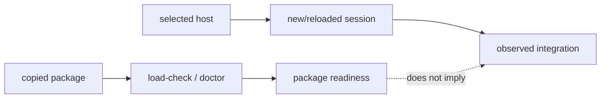

# Package delivery

This page explains the deployment boundary in code terms. A plugin package contains files a host may load; it does not contain the host's marketplace database, session state, or connector process table.

## Local-first onboarding

Keep the pinned `v1.0.2` release in a permanent folder, open or link it in the
selected host, give the agent
`https://github.com/elvinzhao10/LazyBuddy`, and type `onboard`. The agent asks
which host is in use, runs safe package checks, and reports package readiness
separately from host readiness. Before a host-managed marketplace, plugin,
Skills, or connector change it asks for approval, then gives one exact action
and waits. After the response it inspects the host with Computer Use; any
reload/new-session step is separate. WorkBuddy's supported fallback is Skills
import plus six individual manual local MCP connectors. Files or load-check
output never imply WorkBuddy commands, agents, hooks, or MCP loaded without a
real full-plugin session. Host proof must show one real Skill/command and every
expected MCP connection. If Computer Use is unavailable, a user-pasted verbatim
status or screenshot is observed evidence; otherwise **HOST READINESS:
PENDING**.

Route status is explicit: the local marketplace is the **documented CodeBuddy
CLI route and the preferred CodeBuddy IDE route whenever the CodeBuddy CLI is
available**. CodeBuddy IDE GUI loading and WorkBuddy full-plugin loading are
**observed-build routes** only. The `manual-skills-mcp-fallback` is the
supported local fallback. Package checks never upgrade any route to host proof.

## Copyable versus observed state

`lazybuddy-plugin/` can be copied and checked in isolation. `scripts/lazybuddy-load-check.sh` inspects the selected package root, manifests, inventories, declarations, executable scripts, and tooling contract. `lazybuddy-plugin-doctor.sh` adds health diagnostics. Neither script asks a host to install a plugin or open an MCP connection.

The host is a second runtime. CodeBuddy and WorkBuddy choose how plugins are discovered, when hooks receive events, and when MCP launchers are spawned. The package models that with declarations and tests; it deliberately does not scan or mutate host-owned paths to infer success.

## Two evidence channels



The first channel supports claims about package contents. The second supports claims about host loading. Keeping the channels separate is what lets uninstall be safe: package removal cannot guess where a host stored marketplace or connector data.

## Delivery surfaces

CodeBuddy CLI uses these documented terminal commands against the absolute
release root (not the nested `lazybuddy-plugin/` directory):

```text
codebuddy plugin marketplace add <absolute-release-root>
codebuddy plugin install lazybuddy@lazybuddy
```

Inside a CodeBuddy session, the interactive `/plugin` menu is equivalent; do
not use the slash forms as terminal commands. CodeBuddy IDE uses that same
user-scope CLI marketplace route whenever the CLI is available; its supplied
GUI Add local directory flow failed. If the CLI is unavailable, use the public
Skills import plus manual MCP JSON fallback. WorkBuddy's supplied build
exposed a full plugin route only after the observed cache preparation and GUI
`+` binding described below. The supported local fallback remains Skills-only
import plus six manual connectors. The fallback excludes commands, agents, and
hooks. Full plugin/manual coexistence is unsupported: stop the session, remove
only old LazyBuddy entries through the host UI, choose one route, start a new
session, and verify it.

For CodeBuddy IDE, the GUI full-plugin sequence is an observed-build
alternative only: add the release root as a local directory marketplace, wait
for discovery, install as a separate action, fully restart, then verify a fresh
session. The supplied GUI flow failed, so prefer the CLI route and retain
**HOST READINESS: PENDING** until observed.

### WorkBuddy observed-build route

The supplied WorkBuddy GUI Install action hung in an orphaned `plugin
validate`. Do not click the GUI Install action or direct users to it. Do not
hand-edit
`known_marketplaces.json`, because those entries were dropped on restart. Before
asking for approval, run this read-only preflight from the
release root:

```bash
bash lazybuddy-plugin/scripts/lazybuddy-workbuddy-preparation-check.sh \
  --project-dir <absolute-project-root>
```

It renders/checks package inputs and the six absolute MCP launchers, prints
`HOST_PREPARATION=not-applied`, `HOST_MUTATION=none`, and
`HOST_READINESS=pending`, and does not prepare the cache, register
`installed_plugins.json`, or prove host readiness. `--apply` refuses with no
host mutation because the WorkBuddy registry schema is private and unverified.
The supplied WorkBuddy v5.2.6 macOS QA observed the successful full-plugin route only after an agent
prepared a cache with the absolute MCP render and a registry update, followed
by the user's GUI `+` binding. Those artifacts are build-specific evidence, not
a generic installer recipe. Before any host-managed cache or registry
mutation, require both explicit user approval and current host-specific schema
inspection with a validated merge plan that preserves all existing user entries
and unknown fields. If that plan cannot be established, stop and use the
Skills/manual-MCP fallback. If it can be established and the user approves,
perform only that validated additive plan; never overwrite an unrecognized
registry or claim host readiness from the mutation. Then give exactly one GUI
action: open **Skills →
Plugins**, find `lazybuddy`, and click **+**; wait. Ask for a fully restarted
fresh session as a later action and inspect one real Skill/command, 14 commands,
13 agents, 12 hooks, and all six MCP connections. If `+` is unavailable, use
the fallback; it supplies Skills plus six MCP connectors only and never
commands, agents, or hooks.

The supplied 2026-07-18 macOS reports inspected WorkBuddy v5.2.6 on macOS; the
CodeBuddy exact host version/build was not recorded, and an unsupported build
remains **HOST READINESS: PENDING**. The fallback's exact
non-mutating six-entry JSON—with absolute release-local `server.sh` arguments,
`cwd`, `CWD`, and `CODEBUDDY_PROJECT_DIR` set to the consumer project—is in
[Host routes](reference/host-routes.md#manual-connector-specification).

`.codebuddy/settings.json` is shareable non-secret project scope; ignored
`.codebuddy/settings.local.json` is local/machine scope, and secrets must never
be committed. `--plugin-dir` is development/testing only, never persistent.
The detailed host adapters are in [Host capability matrix](10-host-capability-matrix.md)
and [Host routes](reference/host-routes.md).
