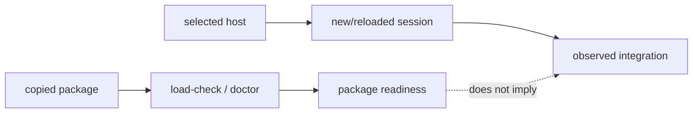

# Package delivery

This page explains the deployment boundary in code terms. A plugin package contains files a host may load; it does not contain the host's marketplace database, session state, or connector process table.

## Copyable versus observed state

`lazybuddy-plugin/` can be copied and checked in isolation. `scripts/lazybuddy-load-check.sh` inspects the selected package root, manifests, inventories, declarations, executable scripts, and tooling contract. `lazybuddy-plugin-doctor.sh` adds health diagnostics. Neither script asks a host to install a plugin or open an MCP connection.

The host is a second runtime. CodeBuddy and WorkBuddy choose how plugins are discovered, when hooks receive events, and when MCP launchers are spawned. The package models that with declarations and tests; it deliberately does not scan or mutate host-owned paths to infer success.

## Two evidence channels

The first channel supports claims about package contents. The second supports claims about host loading. Keeping the channels separate is what lets uninstall be safe: package removal cannot guess where a host stored marketplace or connector data.

## Delivery surfaces

CodeBuddy IDE and CLI use host plugin discovery. WorkBuddy may use a documented plugin/marketplace surface or a narrower local-skills import path. The latter imports skills only; it is intentionally not represented as automatic agent, hook, command, or MCP loading. The detailed host adapters are in [Host capability matrix](10-host-capability-matrix.md) and [Host routes](reference/host-routes.md).
