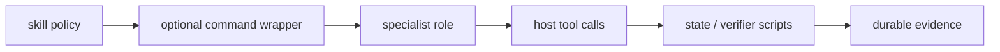

# Workflow playbooks

LazyBuddy is a workflow harness, not a promise that every host surface has
loaded it. Start with the smallest workflow that fits the request, and keep
host observations separate from package evidence. See [host routes](reference/host-routes.md)
before assuming a command is available.

## Choose a workflow

| Situation | Start with | Outcome |
| --- | --- | --- |
| Need a map of an unfamiliar repository | `lazy-init-deep` | Hierarchical project memory and a `.lazybuddy/context/` knowledge base. |
| Request is vague, large, or has design choices | `lazy-ulw-plan` | One decision-complete plan; it does not implement product code. |
| An approved plan is ready to execute | `lazy-start-work` | Orchestrated delegation, evidence, and review gates. |
| Completion must stay open until criteria have proof | `lazy-ulw-loop` | Goals with binding success criteria and recorded evidence. |
| A completed change needs independent review | `lazy-review-work` | Five review lanes: goal, QA, code, security, and context. |
| A bug has uncertain runtime cause | `lazy-debugging` | Hypotheses tested against observed runtime state. |
| A bounded cleanup follows green regression tests | `lazy-remove-ai-slops` | Behavior-preserving cleanup. |
| You need a high-precision, evidence-led pass | `lazy-ultrawork` | Tiered work with manual-QA discipline. |

CodeBuddy exposes the command workflows as `/lazybuddy:lazy-<command>` after
the host has loaded the plugin. In WorkBuddy, use a verified plugin session or
the equivalent natural-language/imported-skill workflow; copied-repository
plugin installation is not verified. The [installation and host verification guide](03-install-and-host-verification.md)
explains the initial route.

## The normal path

1. Establish the package and host boundary with [verification](05-evidence-and-completion.md).
2. For work with unclear decisions, plan first with `lazy-ulw-plan`.
3. Start an approved plan with `lazy-start-work`; that role delegates rather
   than directly implementing product code.
4. Gather the checks and real-surface evidence appropriate to the change.
5. Use `lazy-review-work` when the work merits the five-lane gate, then record
   the result in durable project memory with `lazy-librarian` when applicable.

`lazy-ulw-plan` is deliberately sticky: a request to build something becomes
planning until the user explicitly starts the plan. This prevents a plan from
quietly becoming unreviewed implementation.

## Command and skill inventory

The package contains 14 portable `lazy-` skills and 14 current command
workflows. The commands are: `lazy-init-deep`, `lazy-librarian`,
`lazy-migration-planner`, `lazy-new-run`, `lazy-resume`, `lazy-review-work`,
`lazy-reviewer`, `lazy-start-work`, `lazy-status`, `lazy-ultrawork`,
`lazy-ulw-loop`, `lazy-ulw-plan`, `lazy-verifier`, and `lazy-verify`.

The skill inventory is: `lazy-debugging`, `lazy-git-master`,
`lazy-init-deep`, `lazy-librarian`, `lazy-migration-planner`,
`lazy-programming`, `lazy-remove-ai-slops`, `lazy-review-work`,
`lazy-reviewer`, `lazy-start-work`, `lazy-ultrawork`, `lazy-ulw-loop`,
`lazy-ulw-plan`, and `lazy-verifier`. Commands are host invocation surfaces;
skills describe the workflow. They are not proof of live host loading.

## Useful variations

- Use `lazy-migration-planner` for a semantic host-adapter plan. It writes
  adapter documentation, not product code.
- Use `lazy-verifier` or `lazy-verify` to reproduce claimed checks and issue an
  evidence-based verdict.
- Use `lazy-reviewer` for a focused review; use `lazy-review-work` for the
  full five-agent review gate.
- Use `lazy-new-run`, `lazy-resume`, and `lazy-status` to manage workflow run
  state rather than reconstructing it from memory.
- Use `lazy-git-master` only for an explicitly requested Git operation or
  history question.

Next: learn what counts as completion in [evidence and completion](05-evidence-and-completion.md),
or see the complete [package map](07-package-map.md).

## How policy becomes behavior

The playbooks are deliberately declarative. `skills/lazy-*/SKILL.md` tells an agent which evidence and constraints matter; `commands/lazy-*.md` gives a host named entry point; `agents/*.md` narrows the prompt to a specialist role. The operational side effects live elsewhere, in scripts, hooks, MCP endpoints, and the project being changed.

This split is intentional. A host can expose a skill without exposing a slash command, and a declared agent can exist without being selected for a task. The package tests the files and local scripts; actual selection and execution are host/session observations.
