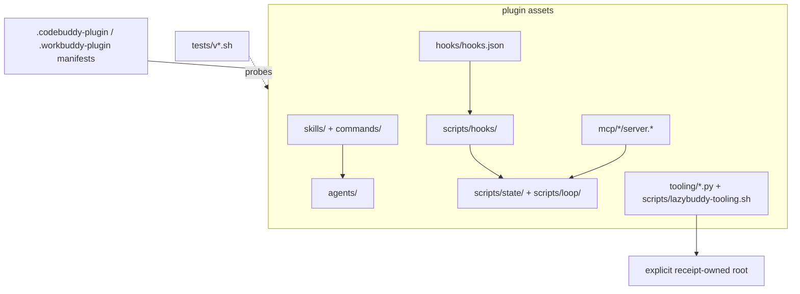

# Package map

`lazybuddy-plugin/` is the only runtime package. Its directory layout mirrors the way a host sees the harness: declarative workflow text, event adapters, local executable services, and verification.

## Roles and events

`skills/` and `commands/` are prompt-facing policy. Each describes a bounded workflow and its expected evidence. `agents/` provides focused roles such as planning, implementation, verification, QA, security, and context gathering. These files have no process authority by themselves; they are loaded only if the host accepts the package.

`hooks/hooks.json` declares which host event may call a script. The scripts under `scripts/hooks/` read structured input, apply narrow local policy, and avoid treating untrusted text as a shell command. Their output is host advice or local evidence, not proof that the host enforced the result.

## Local MCP inventory

The six declarations in `.mcp.json` launch package-local services:

| Server | Source boundary | Purpose |
| --- | --- | --- |
| `run-ledger` | shell launcher + state scripts | Read/write durable workflow records. |
| `verification` | shell launcher + verifier | Report bounded package checks. |
| `status-dashboard` | launcher + static dashboard | Display package/run status. |
| `context-graph` | Python heuristic | Local grep-based relationships, not semantic CodeGraph. |
| `code-intel` | Python service | Local code-oriented helpers. |
| `docs` | Python registry client | Fixed-registry documentation lookup with SSRF boundaries. |

Each declaration is a recipe for a host. It becomes a service only when the host starts it over stdio. [07b — MCP lifecycle](07b-mcp-lifecycle.md) follows that boundary in detail.

## Trace one request through the code

1. A user request selects a skill/command and, where applicable, a role definition.
2. Host tool activity can produce a structured hook event. `pre-tool-use.sh` and `post-tool-use.sh` inspect supported fields, while the package avoids granting authority based on free-form text.
3. State helpers under `scripts/state/` create or update a run, plan, task, event, or checkpoint. Loop helpers use that state to choose the next bounded action.
4. `lazybuddy-verify.sh` runs package-owned checks through `lazybuddy-bounded-run.py`. Each check gets an owned process group, a deadline, JSON status/reason, and best-effort cleanup. This is not a security sandbox; untrusted commands need VM or container-backed isolation.
5. The tests invoke these boundaries from copied/isolated fixtures, so package readiness never relies on a sibling checkout or a live host.
