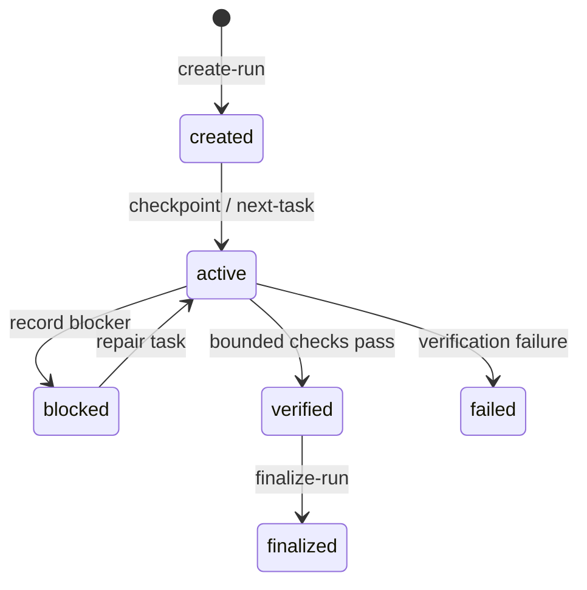

# State and validation

LazyBuddy makes long-running work inspectable by writing explicit run artifacts instead of relying on conversation memory. State scripts own the transition rules; callers should not synthesize ledger files by hand.

## Run artifacts

The `scripts/state/` helpers create, locate, load, summarize, and validate the active run. `scripts/loop/` builds on that stable layout to classify a failure, create a repair task, select the next task, checkpoint progress, and finalize a completed run. Event append operations preserve a chronological record instead of rewriting a narrative summary.

The important invariant is that state is descriptive rather than authoritative over the host: a record can show that the package ran a check, but it cannot prove that CodeBuddy or WorkBuddy loaded a plugin or completed a host action.

## Validation is observable and bounded

`lazybuddy-verify.sh` is an aggregate dispatcher, not a sandbox. It invokes package-owned checks through `lazybuddy-bounded-run.py`, which starts each check in a separate process group and records status, reason, output tail, timeout information, and detectable escaped descendants.

On deadline the runner performs **best-effort** termination of its owned process group. It reports a detectable escape instead of promising descendant cleanup. This is **not a security sandbox**: verification commands are trusted package-owned code. A genuinely untrusted command belongs in a **VM or container-backed runner**, not this process-group mechanism.

## Read state at the correct boundary

`lazybuddy-load-check.sh` and doctor examine copied package inventory and contracts. The run ledger records package-local workflow activity. Neither means a host discovered the package, ran SessionStart, enforced a hook, or connected MCP. The required final fact for those claims is a host observation.
