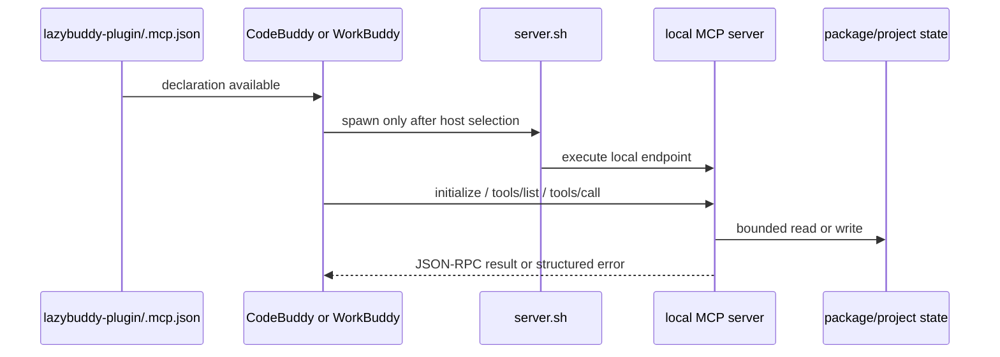

# MCP lifecycle

An MCP declaration is static configuration. A connected MCP tool is a running stdio process speaking JSON-RPC. LazyBuddy documents and tests both layers without confusing either with host proof.

## The six local declarations

`.mcp.json` contains six package-local launcher entries: `run-ledger`, `verification`, `status-dashboard`, `context-graph`, `code-intel`, and `docs`. Their server scripts derive the package root from their own location rather than a sibling checkout. The docs endpoint accepts only validated package identifiers and fixed HTTPS registry endpoints; it does not follow package metadata homepages or arbitrary redirects.

`context-graph` is a local grep-based heuristic. It is intentionally not a semantic CodeGraph replacement. Filesystem and Playwright are not part of the base local inventory.

## Protocol boundary

Python helpers under `mcp/` use shared JSON-RPC and path-boundary logic. A server must emit protocol messages only on stdout, keep diagnostics on stderr, reject malformed requests with a structured JSON-RPC error, and keep reading later lines after a bad request. Regression fixtures exercise the malformed-stream behavior so one client mistake does not poison the next request.

## Host-specific route

The host decides whether and when to spawn a declaration. Package readiness can prove that launcher files and declarations exist; it cannot prove the host imported them, created a child process, or completed `initialize`. Host settings, credentials, connector state, and session lifetime remain host-owned. Optional CodeGraph and remote providers export explicit, user-merged fragments rather than silently registering persistent connectors.
